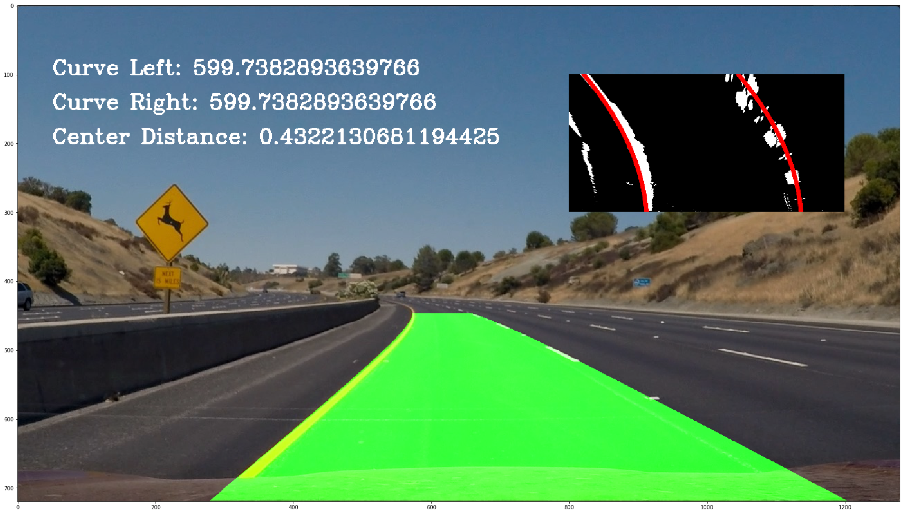

**Advanced Lane Finding Project**

The goals / steps of this project are the following:

* Compute the camera calibration matrix and distortion coefficients given a set of chessboard images.
* Apply a distortion correction to raw images.
* Use color transforms, gradients, etc., to create a thresholded binary image.
* Apply a perspective transform to rectify binary image ("birds-eye view").
* Detect lane pixels and fit to find the lane boundary.
* Determine the curvature of the lane and vehicle position with respect to center.
* Warp the detected lane boundaries back onto the original image.
* Output visual display of the lane boundaries and numerical estimation of lane curvature and vehicle position.


## [Rubric](https://review.udacity.com/#!/rubrics/571/view) Points

### Here I will consider the rubric points individually and describe how I addressed each point in my implementation.  


### Camera Calibration

#### 1. Briefly state how you computed the camera matrix and distortion coefficients. Provide an example of a distortion corrected calibration image.

The code for this step is contained in the first code cell of the IPython notebook located in "https://github.com/henrisve/CarND-Advanced-Lane-Lines/blob/master/Analyse_data.ipynb" 
I start by preparing "object points" in the "calc_objimg_points" function. This function simply takes the images and calculate using findChessboardCorners() thats in cv2. It's pretty good described in the template for this file:

"which will be the (x, y, z) coordinates of the chessboard corners in the world. Here I am assuming the chessboard is fixed on the (x, y) plane at z=0, such that the object points are the same for each calibration image.  Thus, `objp` is just a replicated array of coordinates, and `objpoints` will be appended with a copy of it every time I successfully detect all chessboard corners in a test image.  `imgpoints` will be appended with the (x, y) pixel position of each of the corners in the image plane with each successful chessboard detection."

Then i just take a random image of those and put it into my undistort function that uses cv2.calibrateCamera and cv2.undistort to undistort it.
After this corners_unwarp can be used to wrap the images to look right onto the chessboard.
Here's the resulting images:


### Pipeline (single images)

#### 1. Provide an example of a distortion-corrected image.

To demonstrate this step, I will describe how I apply the distortion correction to one of the test images like this one:


#### 2. Describe how (and identify where in your code) you used color transforms, gradients or other methods to create a thresholded binary image.  Provide an example of a binary image result.

I used a combination of Sobel threshold, magnitude, direction and the S channel to generate a binary image (see code cell 3 and 4). 
To find a good mix used Interact, so that I got sliders to find the best combination.
However, I do believe I could do much better in this step, both in getting better values and probably other methods. 
 
Here's two examples of my output, one pretty good and one rather terrible. The first 3 is x/y-Sobel, magnitude/direction and finally the S channel. The 4th is these combined. 


#### 3. Describe how (and identify where in your code) you performed a perspective transform and provide an example of a transformed image.

This happens in cell 2, and happens directly after the binary thingy, so see pictures above. 

 I chose the hardcode the source and destination points by inspecting the images manually in paint:

| Source        | Destination   | 
|:-------------:|:-------------:| 
| 200, 720      | 300, 720        | 
| 594, 450      | 300, 100      |
| 686, 450     | 980, 100      |
| 1080, 720      | 980, 720        |


I verified that my perspective transform was working as expected by drawing the `src` points onto a test image and its warped counterpart to verify that the lines appear parallel in the warped image. This can be seen in the undist image above.


#### 4. Describe how (and identify where in your code) you identified lane-line pixels and fit their positions with a polynomial?

Here I basically used the code from the course, I tried to do some more cool things to make it fit better. but ended up getting worse so went
back to the original in the end as I'm already way to late over the deadline. This can be found in cell 5.
Here's an image with an okay fit.



Some of the new things I tried to do was to use the fact that the distance between the lines is constant. So i did:
1. The search window follows the curve, i.e when turning left the right window goes up more than the left.
2. Always the same distance between the windows.
3. Instead of using all the points, use a small window for selection, and bigger for the search.
4. As we know it should be the same distance, the two lines should overlap if we move one line the distance between them, by doing that and then take the peak we should get a good estimate even if only one side is good.


It looks pretty promising in the images, but unfortunately this worked shit.
Another idea was to make a weight for the polyfit by taking pixels in the small window/pixels in big window. So if we have lots of pixels inside the small window, and few in proximity next to it, we know it's pretty good, but if we have lots of pixels around our window aswell, we know it's something wrong with these.


#### 5. Describe how (and identify where in your code) you calculated the radius of curvature of the lane and the position of the vehicle with respect to center.

I did this in cell 9 using this:
```python
left_curverad =  ((1 + (2*left_fit_cr[0] *y_eval*ym_per_pix + left_fit_cr[1] )**2)**1.5) / np.absolute(2*left_fit_cr[0])
right_curverad = ((1 + (2*right_fit_cr[0]*y_eval*ym_per_pix + right_fit_cr[1])**2)**1.5) / np.absolute(2*right_fit_cr[0])
center_dist=(left_fitx[-1]+right_fitx[-1])*xm_per_pix/2 - (out_img.shape[1]*xm_per_pix)/2 
```

#### 6. Provide an example image of your result plotted back down onto the road such that the lane area is identified clearly.

I did this in the same as above (8) in the function process_image(), it takes an image(or images from video), do all the things described above, then warp it the other way around (dst to src instead of src to dst)(done in cell 7), then merge this with original image. I also add text and the binary images on top to easily follow what happens.


---

### Pipeline (video)

#### 1. Provide a link to your final video output.  Your pipeline should perform reasonably well on the entire project video (wobbly lines are ok but no catastrophic failures that would cause the car to drive off the road!).

Here's a [link to my video result](./test_videos_output/project_video.mp4)

---

### Discussion

#### 1. Briefly discuss any problems / issues you faced in your implementation of this project.  Where will your pipeline likely fail?  What could you do to make it more robust?

It went pretty bad, I had some new ideas put turned out to be worse, so pretty much ended up with the basic directly from the course, I also didn't use the "skip sliding window" part, which probably would be a better idea to start with instead of trying to improve the sliding image part which is just slow and worse anyway.. probably would be better to spend the time on generating better binary images etc.. If I get more time after the next project I will fix that and use a class for tracking the curves as recommended in the course.
